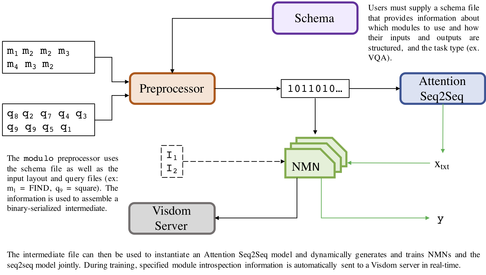
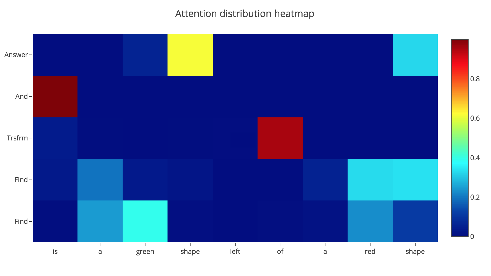

# modulo



## Quickstart
To train `modulo` on the SHAPES dataset, first run the preprocessor:
```
python preprocessing.py -task_type vqa -query_train open-nmt_data/train.cat.query_str.txt -query_valid open-nmt_data/val.query_str.txt -query_test open-nmt_data/test.query_str.txt -layout_train open-nmt_data/train.cat.query_layout_symbols.txt -layout_valid open-nmt_data/val.query_layout_symbols.txt -layout_test open-nmt_data/test.query_layout_symbols.txt -answer_train shapes_dataset/train.cat.output -answer_valid shapes_dataset/val.output -answer_test shapes_dataset/test.output --img_train shapes_dataset/train.cat.input.npy --img_valid shapes_dataset/val.input.npy --img_test shapes_dataset/test.input.npy --batch_size 64 --gpu_support True
```

This step will create the `pkl` file needed by the trainer. Then, simply run `python train.py`.

## Modules and Schema
If you would like to extend the existing module library (in `modules.py`), please add a PR. Same story for adding different task schemas.


